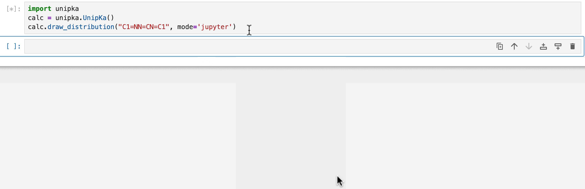
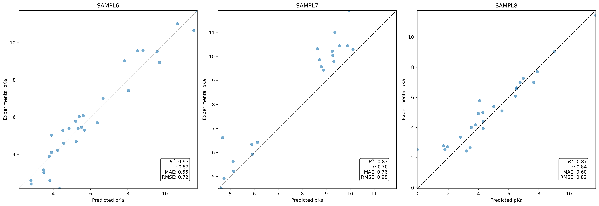
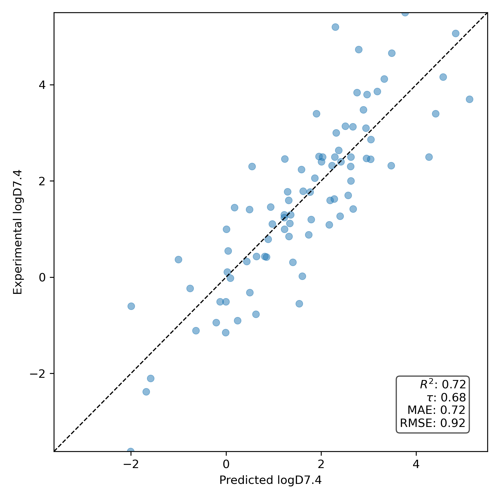

### Unofficial inference wrapper around DPTech's UnipKa model

This repo provides a simple wrapper around Zheng and co's fantastic UnipKa model. It refactors their [example notebook](https://www.bohrium.com/notebooks/38543442597) into a small python package. If you use this package in a scientific publication, please make sure to cite their work.

As the UnipKa model provides pH-adjusted free energies (and therefore populations) for each microstate, we also provide a logD calculator following the methodology of [Rowan Sci](https://chemrxiv.org/engage/chemrxiv/article-details/68388349c1cb1ecda02ba65d), by calculating the weighted average of logP values for each microstate. We also provide a state penalty function, useful for calculating permeability of neutral species, also following the methodology of [Rowan Sci](https://chemrxiv.org/engage/chemrxiv/article-details/68388349c1cb1ecda02ba65d) and [Lawrenz and co](https://pubs.acs.org/doi/10.1021/acs.jcim.3c00150). Please cite the corresponding authors if you use either the state penalty or logD calculation in your work.

We also provide a small Jupyter widget to visualise the microstate distributions across a range of pH values.

Install using `pip install .`

Please see `examples.ipynb` or the unit tests for example usage.

Performance on the SAMPL benchmarks (pKa prediction):

Performance on logD benchmark:

